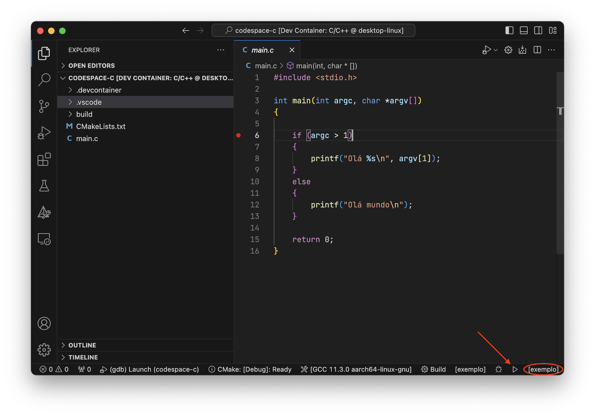
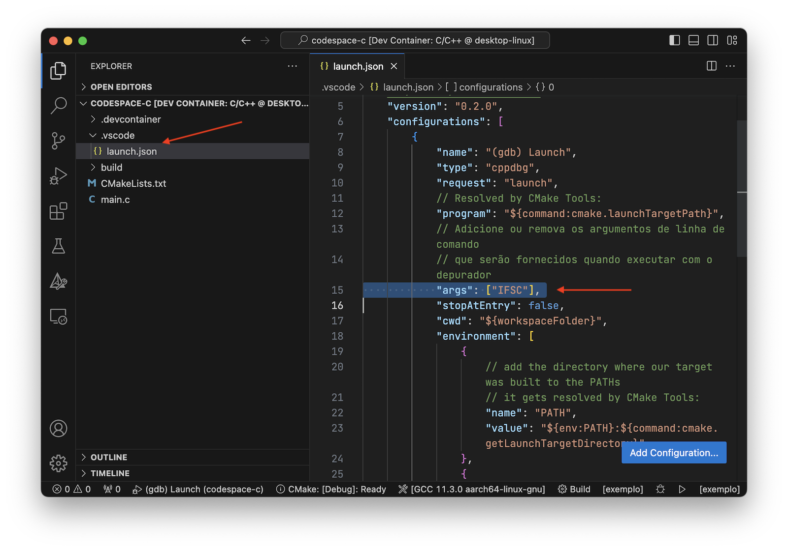
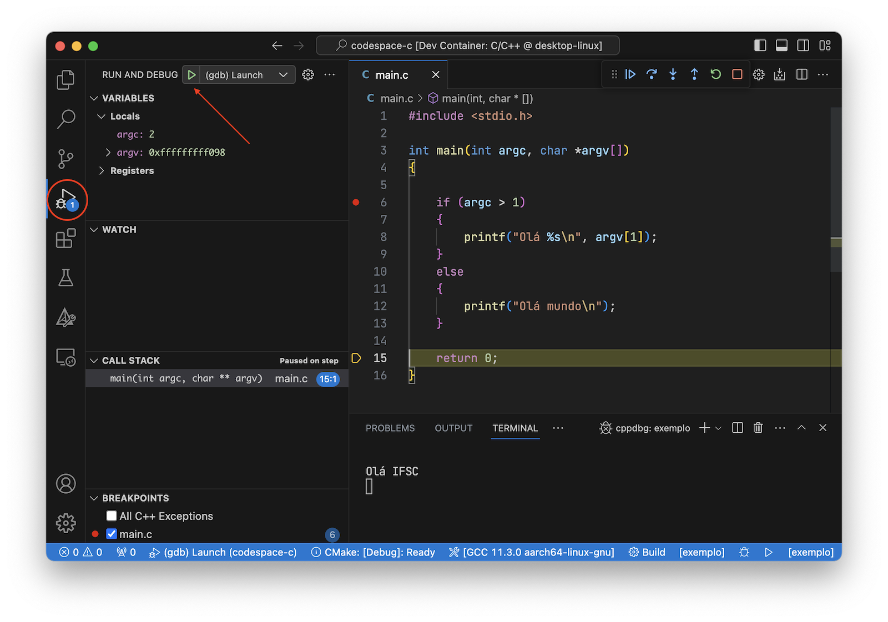

# *Devcontainer* para C com CMake

Modelo de devcontainer para desenvolvimento de aplicações em C com o CMake como ferramenta de construção e com o [*clangd language server*](https://clangd.llvm.org).

Caso crie mais arquivos `.c` e `.h` em seu projeto, essas adições precisarão ser refletidas no arquivo [CMakeLists.txt](CMakeLists.txt)

## Como executar a aplicação

Para **construir** a aplicação basta clicar no botão `Build` na barra de *status*. Por padrão o alvo do *build* estará como *all*, pode alterar para exemplo, que é o nome desse projeto.

Para **executar** a aplicação basta clicar no ícone :arrow_forward: na barra de *status* (ou pressionar `Shift + F5`). Garanta que o alvo seja exemplo, nome desse projeto. 

## Como executar o depurador

Para fazer a depuração do seu código será necessário criar uma configuração no arquivo  [.vscode/launch.json](.vscode/launch.json), caso você queira fazer uso de argumentos de linha de comando. 

Esse repositório já tem esse arquivo criado e se desejar usar argumentos de linha de comando, então edite o arquivo [.vscode/launch.json](.vscode/launch.json) e troque o valor `IFSC` que está associado à chave `args`.

Se não quiser usar argumentos de linha de comando, então é possível executar a depuração de maneira rápida usando a tecla de atalho `Ctrl + F5`.

Para executar a depuração será necessário abrir o painel `Run and Debug` e depois clicar no botão :arrow_forward: que aparece no topo do painel aberto. Mas antes, lembre-se de criar os pontos de parada (*breakpoints*) no código fonte.

## Documentação sobre CMake e Visual Studio Code

- https://code.visualstudio.com/docs/cpp/cmake-linux
- https://github.com/microsoft/vscode-cmake-tools/blob/main/docs/README.md
